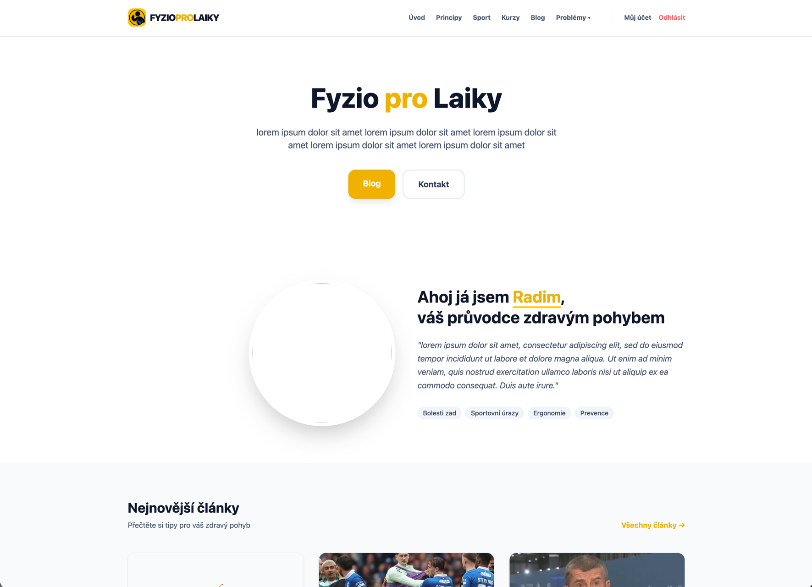
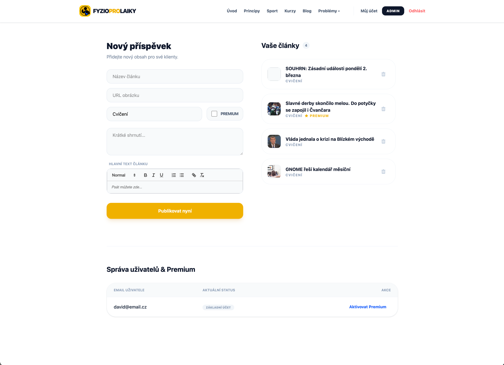

# FyzioProLaiky Web

A full-stack web application designed as physiotherapy education and content management. This platform provides a seamless experience for users to learn about physiotherapy through articles, while offering a robust administration system for content creator.

## Screenshots

*Visual preview of the main landing page and the administrative dashboard.*

## Features

- **User Authentication:** Secure system utilizing JWT tokens and bcrypt for password hashing.
- **Content Management:** Full CRUD capabilities for articles, including categories and preview excerpts.
- **Premium Access Control:** Integrated logic to protect "Premium" content, accessible only to authorized users or administrators.
- **Admin Dashboard:** A dedicated interface for managing the user base, toggling premium memberships, and publishing new articles.
- **Responsive Design:** Mobile-friendly UI built with React and styled using Tailwind CSS.

## Tech Stack

### Frontend
- **React 19**
- **Tailwind CSS 4**
- **React Router 7**

### Backend
- **FastAPI**
- **SQLModel** (SQLAlchemy & Pydantic)
- **PostgreSQL / SQLite**
- **JOSE / JWT**